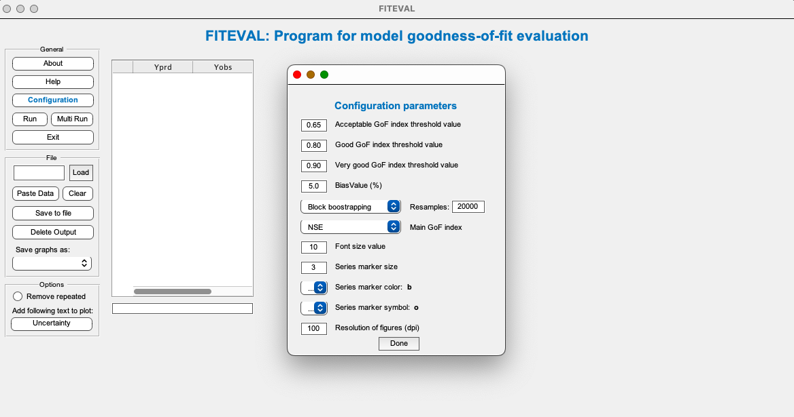

# Supplementary Materials

## Theoretical connections between the Nash–Sutcliffe efficiency and the Kling–Gupta Efficiency for environmental model evaluation

By Axel Ritter1 and Rafael Muñoz-Carpena2,\*

*Under review in Journal of Hydrology, June 2026*

This repository contains the supplementary files with the statistics and metrics for all the datasets used for model evaluation in the manuscript (Table 1).

### 1. Datasets 

**Download Table**

The extended Table containing the metrics for each model evaluation set in the study dataset can be downloaded here **[Datasets_1-10_statistics.csv](Datasets_1-10_statistics.csv)**

**Datasets description**

The model datasets used in the study are summarized in the Table below (Table 1 in manuscript).

| Dataset Nr./ Dataset Ref. | Predicted variables a | N b | NSE range c [KGE range] | Reference |
|---|---|---|---|---|
| **Testing** | | | | |
| 1/FP-WQ | Ground water [F-], [Cl-], [N-NO3-], [P-PO43-], [TP] (-) | 50 | 0.215 – 0.994 [-1014 – 0.836] | Muñoz-Carpena et al. (2005) |
| 2/LOX-EC | Ground water electrical conductivity (-) | 7 | 0.569 – 1.000 [-0.532 – 1.000] | Kaplan and Muñoz-Carpena (2014) |
| 3/LOX-SM | Soil moisture (-) | 12 | 0.629 – 0.983 [-102 – 0.931] | Kaplan and Muñoz-Carpena (2011) |
| 4/LOX-WT | Water table elevation (-) | 12 | 0.778 – 1.000 [-1.794 – 1.000] | Kaplan et al. (2010) |
| 5/OKA-NDVI | Normalized Difference Vegetation Index, NDVI (-) | 240 | 0.508 – 0.931 [-0.261 – 0.623] | Campo-Bescós et al. (2013) |
| 6/SH-WQ | Ground water [N-NO3-] (mg/l) | 18 | 0.462 – 0.985 [0.529 – 0.968] | Ritter et al. (2007) |
| 7/WDPT– 2T | Water droplet penetration time (s) | 80 | 0.546 – 0.967 [0.631 – 0.976] | Regalado and Ritter (2009a) |
| 8/WDPT– 3T | Water droplet penetration time (s) | 80 | 0.549 – 0.991 [0.633 – 0.994] | Regalado and Ritter (2009a) |
| 9/MED | Contact angle (º) | 40 | 0.893 – 0.994 [0.923 – 0.996] | Regalado and Ritter (2009b) |
| **Verification** | | | | |
| 10/CAMELS | Runoff (mm d-1) | 613 | 0.207 – 0.922 [-0.022 – 0.933] | Newman et al. (2015) |

a (-) indicates dimensionless standardized data series, which implies mean of observation close to zero, and thus values with alternating sign in the dataset; b N is the number of model evaluations in each study; c Performance metrics were computed using the FITEVAL software ([Ritter and Muñoz-Carpena (2013)](http://dx.doi.org/10.1016/j.jhydrol.2012.12.004)) option that allows for discarding repeated paired values.

### 2. Analysis tools

FITEVAL (https://abe.ufl.edu/carpena/software/fiteval/) Matlab scripts were used for analysis of the individual {_obsi, predi_} values for each model evaluation in Table 1.

The FITEVAL software was modified following the work in this paper to allow the user to select among a list of goodness-of-fit indicators (NSE, KGE\*, KGE, E1) (see Figure below). Thereby the code performs hypothesis testing of the selected index exceeding a threshold value. In order to rate the model performance, the user can establish threshold values for delimiting the model efficiency classes or "pedigree": e.g. NSE<0.65 (Unsatisfactory), 0.65≤NSE<0.80 (Acceptable), 0.80≤NSE<0.90 (Good) and NSE≥0.90 (Very good) ([Ritter and Muñoz-Carpena, 2013](http://dx.doi.org/10.1016/j.jhydrol.2012.12.004)). If KGE\* or KGE are selected and the model evaluation meets the conditions for Eq.(7) in the paper (high skill and negligible bias), these threshold values were converted to 0.73, 0.85, 0.93, respectively, using the equation derived in this work: $KGE^* = 1 - \sqrt{2}\left(1 - \sqrt{NSE}\right)$, and vice versa using the inverse of this equation: $NSE = 0.5\left(\sqrt{2} - (1 - KGE^*)\right)^2$.

